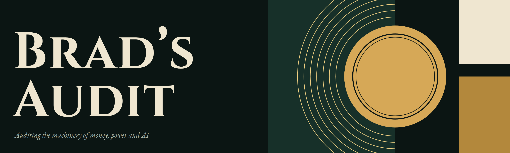

20 years in banking and nonprofit development. Now I audit the machinery of money, power and AI through a covenantal lens. Occasionally funny.

[BiasClear](https://github.com/bws82/biasclear), the AI governance tool I built on my Persistent Influence Theory, is open source here.

Find me on X at [@bradsaudit](https://x.com/bradsaudit).
